# 📊 Diagramas Mermaid - Sistema IoT Dashboard

Este documento contém diagramas em formato Mermaid que podem ser visualizados em plataformas compatíveis (GitHub, GitLab, VS Code com extensão Mermaid).

---

## 🏗️ Diagrama de Arquitetura de Componentes

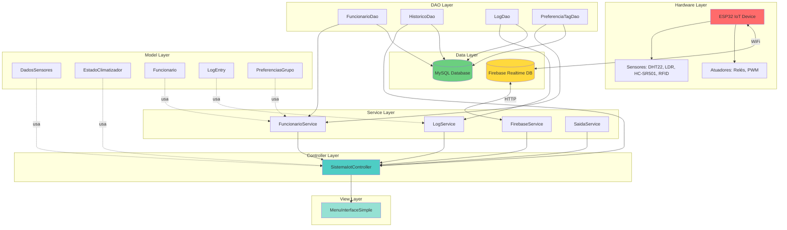

---

## 🔄 Diagrama de Fluxo de Dados (Data Flow)

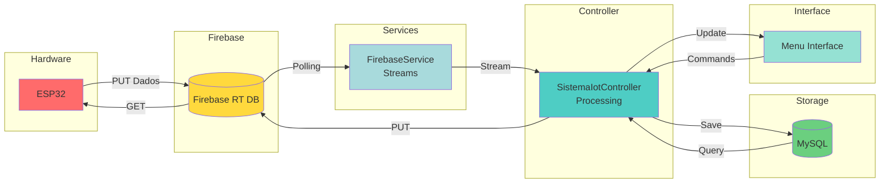

---

## 📋 Diagrama de Classes (Simplificado)

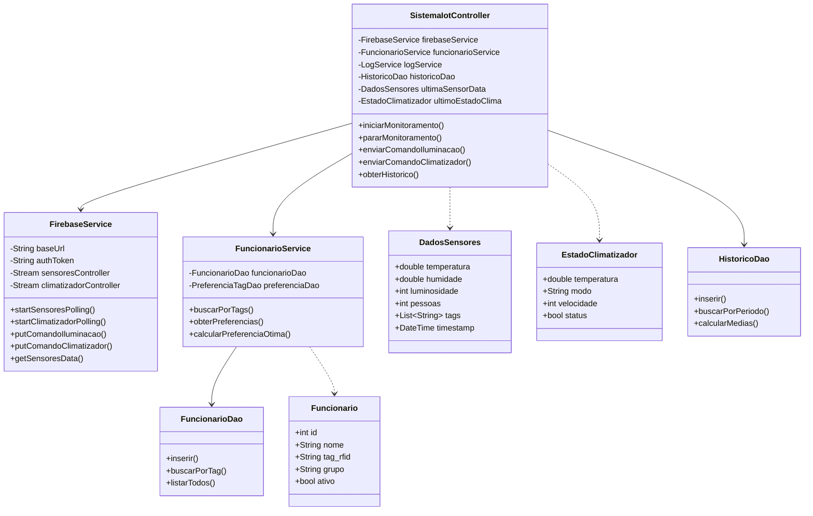

---

## ⚡ Diagrama de Sequência - Processamento de Sensores

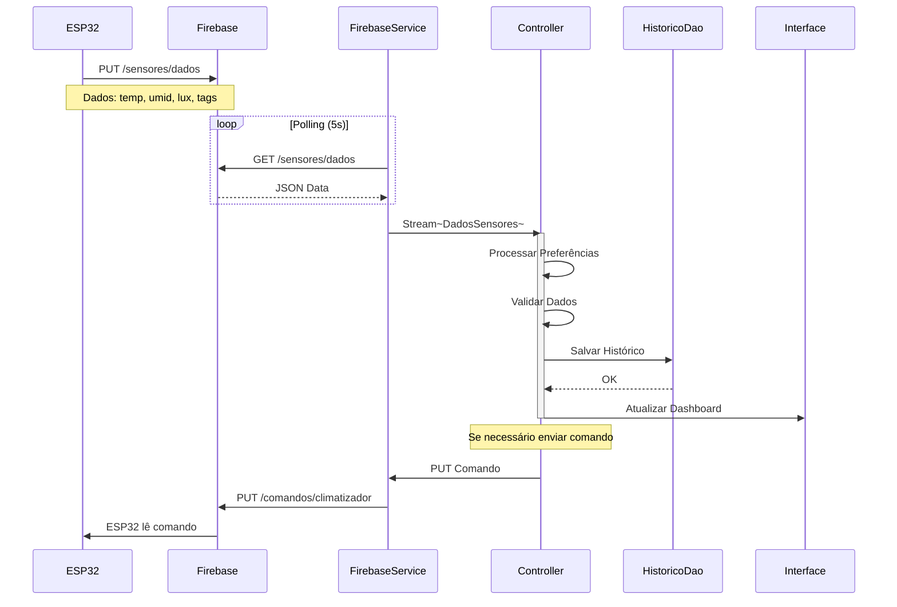

---

## 🎯 Diagrama de Sequência - Aplicação de Preferências

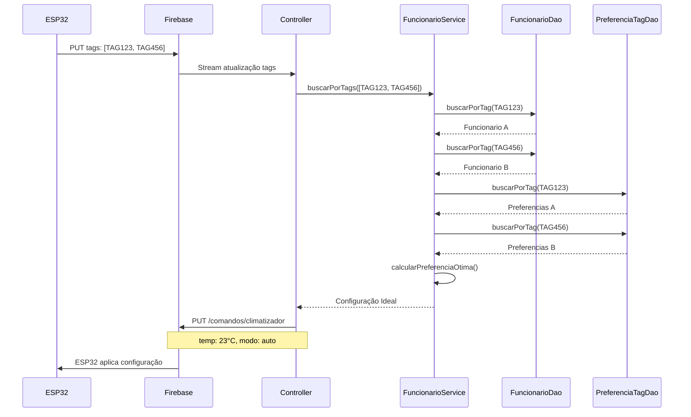

---

## 🗄️ Diagrama de Entidade-Relacionamento (ER)

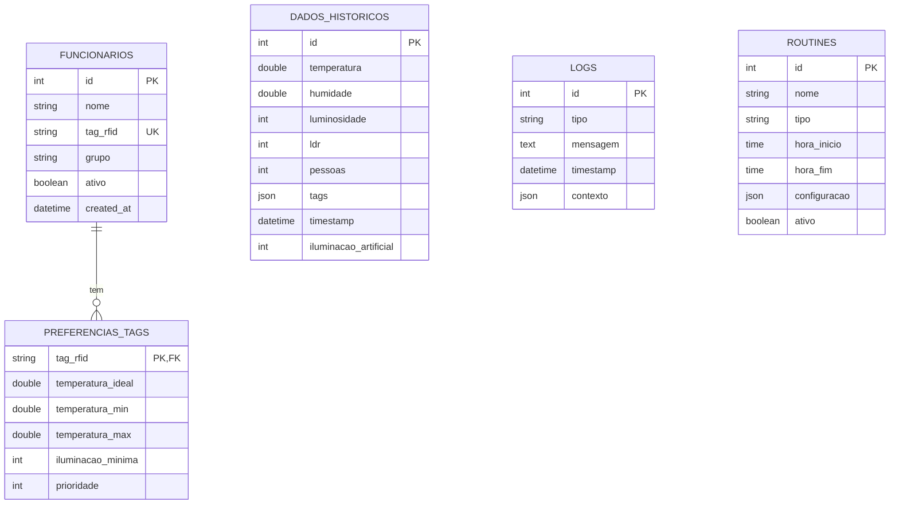

---

## 🔀 Diagrama de Estados - Climatizador

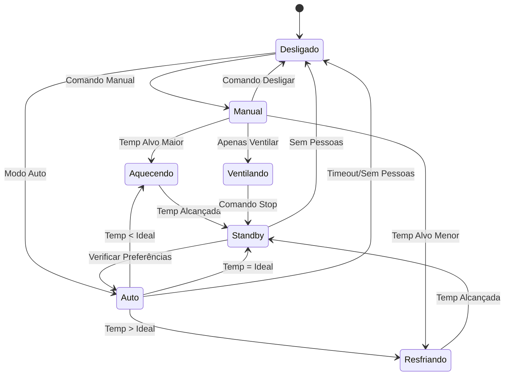

---

## 🔄 Diagrama de Atividades - Monitoramento

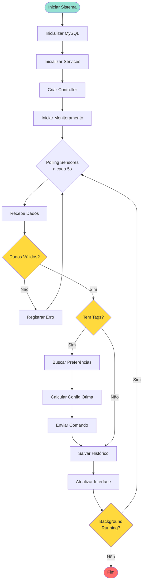

---

## 📦 Diagrama de Deployment

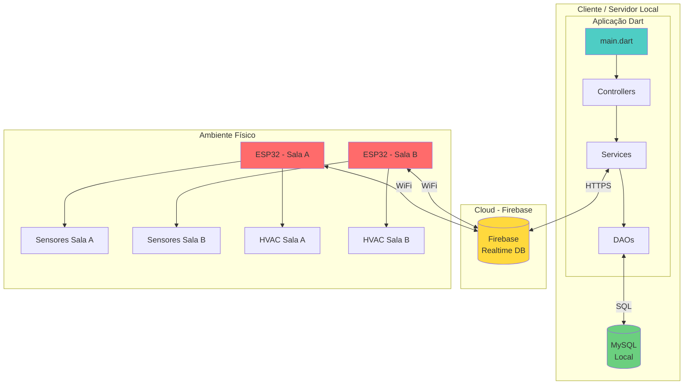

---

## 🎨 Diagrama de Pacotes

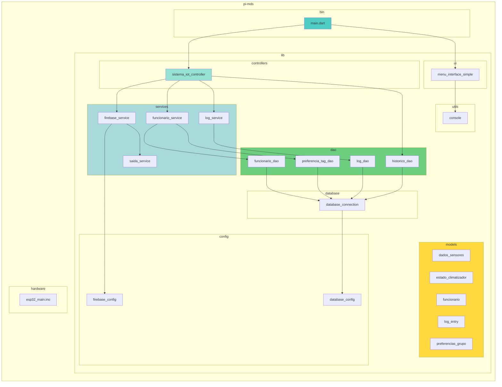

---

## 📊 Diagrama de Casos de Uso

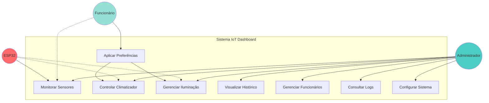

---

## 🔧 Diagrama de Comunicação - MVC

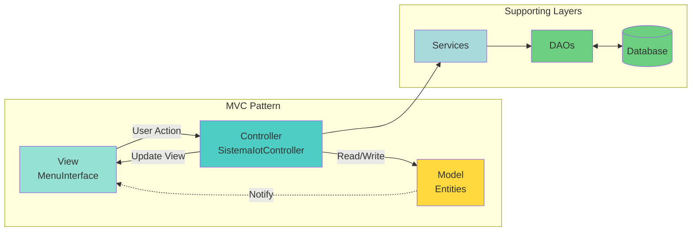

---

## 📈 Diagrama de Tempo - Ciclo Completo

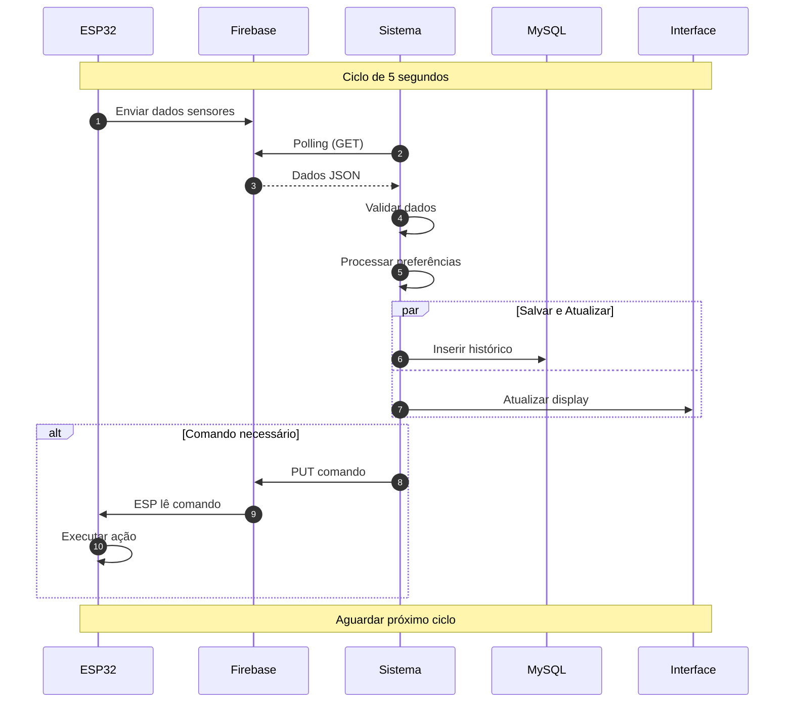

---

**Nota**: Estes diagramas podem ser visualizados em:
- GitHub/GitLab (renderização automática)
- VS Code com extensão Mermaid
- Plataformas online como Mermaid Live Editor
- Ferramentas de documentação compatíveis

Para melhor visualização, recomenda-se usar fundo claro e zoom apropriado.
